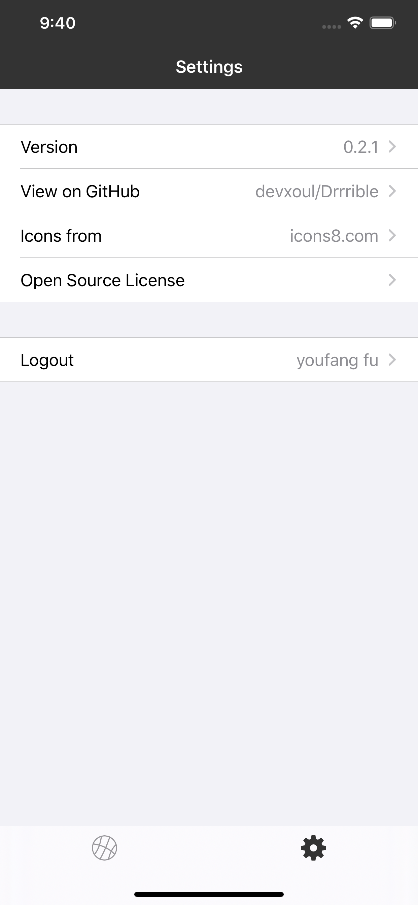
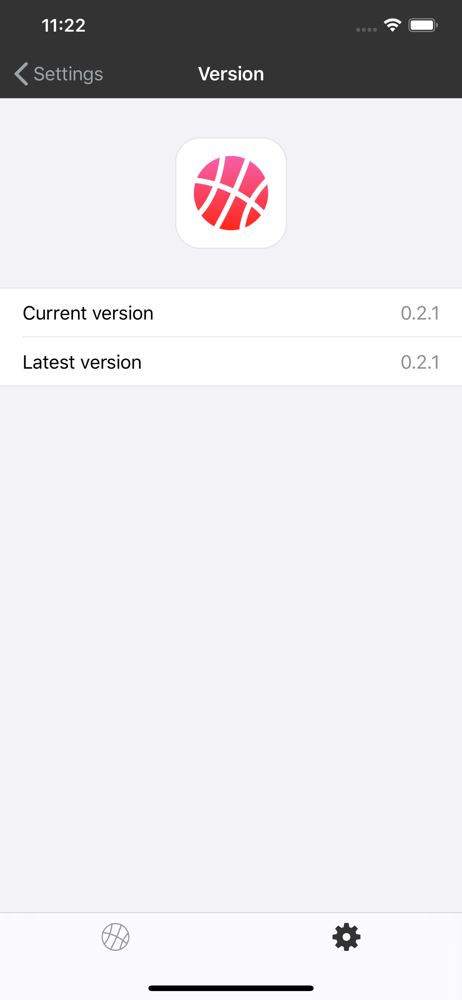

# 1. Drrrible 源码阅读

在看了一些 RxSwift 的资料之后，感觉在做项目的时候还是不知道如何下手，于是阅读了 [Drrrible][0] 的源码。

> 因为 [Drrrible][1] 网站的 API 有所改动，[Drrrible][0] 项目已经不再维护，目前已经无法进入主页面，我 [Forked][2] 之后进行了改动，因为一直 API 已经无法使用，不能看到源项目的所有功能，不过已经可以看到所有页面。
> 因为目前的 API 只能看到自己在 [Drrrible][1] 网站上传的作品，所以还需要自己上传一些图片才能看到部分页面。

这个项目除了可以学习使用 RxSwift 之外，还有很多值得我学习的地方，例如：

- 在一个类中应该如何划分常量，属性，UI，生命周期等内容，使得一个类中的内容非常清晰。
- 所有的常量，所有的重用资源（TableViewCell 等）如何清晰的放到一起。
- 如何尽量简化自己的代码（就像作者的介绍："A lazy developer 😴 I write many code to write less code. "），在简化代码方面得到了很多启发。

下面是在阅读源码的过程中学习到的 RxSwift 的技巧。

## 1.1. ReactorKit 的事件转化

Drrrible 使用了 [ReactorKit][3]， 关于 ReactorKit 可以看我之前写的  [翻译][5] 和 [笔记][4]，

Settings 页面如下：

<div align="center">    
     
</div>


在 Settings 页面，只有当前登录的用户名称是变化的值，其他的值都是固定的。SettingsViewController 对应 Reactor 为 SettingsViewReactor。SettingsViewReactor 肯定不负责管理当前登录用户的信息，那怎么将 Settings 页面中的信息和当前登录的用户信息进行合并呢？

在 SettingsViewReactor 中 state 的 sections 中有一个用于表示登录状态的项，即 logout。负当前用户信息的为 userService.currentUser。
SettingsViewController 上 Logout Cell 中的 username 需要根据当前登录的用户信息进行改变，这个 Cell 又是根据 Reactor 中的 State 进行改变的。

所以在 SettingsViewReactor 中需要将 Action 的 Observable 和 userService.currentUser 的 Observable 进行了合并，共同影响 Setting 页面的展示。Observable 合并的代码位于 ReactorKit 框架下的方法：

```
/// Transforms the action. Use this function to combine with other observables. This method is
/// called once before the state stream is created.
func transform(action: Observable<Action>) -> Observable<Action>
```

具体实现为：SettingsViewReactor 的 state 在初始化时，只负责将 username 设置为了 nil，转化 userService.currentUser 的 Observable ，使其负责发出 updateCurrentUsername 的事件。

```
func transform(action: Observable<Action>) -> Observable<Action> {
    let updateCurrentUsername = self.userService.currentUser
        .map {
            Action.updateCurrentUsername($0?.name)
        }
    // 将自身的 action Observable，和由 currentUser 转化而来的 Observable 进行了合并
    return Observable.of(action, updateCurrentUsername).merge()
}
```


## 1.2. ReactorKit 中 View 的划分

再来看 Version 页面。Version 页面和 Settings 页面类似，其中只有 Latest version 需要从网络上获取。



通常一个 TableViewController 对应的 Reactor 的 State 中都会有一个 sections 的数组属性，用来控制页面中 cell 的展示。但是这个页面，作者并没有用这种方式。

作者将 Version 页面整体看做一个 View，cell 的数量由 ViewController 指定，其中的可变内容直接读取 Reactor 中的 state 值。当 state 值发生改变时，tableView 刷新列表。

我使用通常的实现方法重新实现了 Version 的功能，即：通过 Reactor 中 state 的 sections 的属性来控制 Version 页面的 cell。

对比这两种方式，发现将整个页面看成一个 View 时，代码量相对较少，原因是：

- 减少了创建 cell 对应的 Reactor 的代码
- ViewController 对应的 Reactor 减少了创建控制 cell 的 sections 数组的代码

所以，对于数据量较少的 TableView，可以将整体看做一个 View，可以达到简化代码的目的。

## 1.3. UserService 的设计

UserService 用于控制当前登录的用户信息，需要向外提供 user，也要更新 user，但是 user 的更新权利却不能交给外界。

```swift
final class UserService: UserServiceType {
    
    fileprivate let userSubject = ReplaySubject<User?>.create(bufferSize: 1)

    lazy var currentUser: Observable<User?> = self.userSubject.asObservable()
        .startWith(nil)
        .share(replay: 1)
    
    func fetchMe() -> Single<Void> {
        return self.networking.request(.me)
            .map(User.self)
            .do(onSuccess: { [weak self] user in
                self?.userSubject.onNext(user)
            })
            .map { _ in }
    }
}
```

作者使用 fileprivate 修饰的 userSubject 来控制 user 信息的变更，使用 currentUser 来提供给外界，解决了权限的问题。

## 1.4. 点赞的事件流

Drrrible 最复杂的页面应该就是 Shot 的详情页了。


在列表、详情页对内容进行点赞是一个常规的产品需求，那作者是怎么划分控制这个界面？又有哪些可以学习的地方呢？

### 1.4.1. 拆分 Reactor

详情页的 ViewController 对应的 Reactor 为 ShotViewReactor，作者并没有讲所有的逻辑写在一个 Reactor 当中，而是进行了拆分。在 ShotViewReactor 中，拥有一个负责生成 Shot 详情的ShotSectionReactor。

ShotSectionReactor 将根据 Shot 生成用于展示 Shot 详情的 4 个 Reactor：

- ShotViewImageCellReactor： 对应 image 内容的 Cell
- ShotViewTitleCellReactor：对应 title 的 Cell
- ShotViewTextCellReactor：对应 text 的 Cell
- ShotViewReactionCellReactor：对应点赞和评论的 Cell

其中在 ShotViewReactionCellReactor 中还有两个 Reactor：
- likeButtonViewReactor：对应于点赞按钮
- commentButtonViewReactor：对应于评论按钮

另外 ShotViewReactor 还负责生成 Shot 的评论 Reactor：ShotViewCommentCellReactor。

所以在这样一个界面中，1 个总的 Reactor，1 个辅助的 Reactor，5 个不同的 cell 对应的 Reactor，2 个button 对应的 Reactor，一种出现了 9 个 Reactor。

### 1.4.2. 点赞的数据流
  
点赞按钮用来和用户交互，并显示当前点赞的数量。用户点击按钮之后，点赞数是如何增加呢？

作者将用到的类都继承 ModelType，然后对 ModelType 进行了扩展：

```swift 
private var streams: [String: Any] = [:]

extension ModelType {
    static var event: PublishSubject<Event> {
        let key = String(describing: self)
        if let stream = streams[key] as? PublishSubject<Event> {
            return stream
        }
        let stream = PublishSubject<Event>()
        streams[key] = stream
        return stream
    }
}
```

这样每个符合 ModelType 协议的类都有了 event 的数据流：

```swift
struct Shot: ModelType {
    enum Event {
        case updateLiked(id: Int, isLiked: Bool)
        case increaseLikeCount(id: Int)
        case decreaseLikeCount(id: Int)
    }

    var likeCount: Int?
}
```
Shot.event 就可以发送点赞数量增加、减少等的事件。**这样 Shot 类型的属性值改变就有了一个统一的操作和接收地方。** 点赞按钮的 Reactor 就可以通过 Shot.event 来接收到 Shot 属性值的改变。

那 Shot 的属性什么时候做更改呢？这就要交用于空中 Shot 的 shotService 了。在点赞按钮的 Reactor 发生点击的事件的时候，需要通知 shotService 进行点赞操作。

```swift 
override func mutate(action: Action) -> Observable<Mutation> {
    switch action {
    case .toggleReaction:
        if self.currentState.isReacted != true {
            _ = self.shotService.like(shotID: self.shotID).subscribe()
        } else {
            _ = self.shotService.unlike(shotID: self.shotID).subscribe()
        }
        return .empty()
    }
}
```

shotService 对点赞事件的具体实现如下：

```swift
func like(shotID: Int) -> Single<Void> {
    Shot.event.onNext(.updateLiked(id: shotID, isLiked: true))
    Shot.event.onNext(.increaseLikeCount(id: shotID))
    return self.networking.request(.likeShot(id: shotID)).map { _ in }
        .do(onError: { error in
            Shot.event.onNext(.updateLiked(id: shotID, isLiked: false))
            Shot.event.onNext(.decreaseLikeCount(id: shotID))
        })
}

func unlike(shotID: Int) -> Single<Void> {
    Shot.event.onNext(.updateLiked(id: shotID, isLiked: false))
    Shot.event.onNext(.decreaseLikeCount(id: shotID))
    return self.networking.request(.unlikeShot(id: shotID)).map { _ in }
        .do(onError: { error in
            Shot.event.onNext(.updateLiked(id: shotID, isLiked: true))
            Shot.event.onNext(.increaseLikeCount(id: shotID))
        })
}
```

shotService 首先会更新点赞的数量和状态，然后再进行网络请求。如果网络请求失败，会进行反操作，修正数据状态。这样可以给用户错觉，给用户一种点赞是立即同步到服务器的。在网络请求失败之后，又会提醒用户，给用户再次操作的机会。

### 1.4.3. 不同类型的 Cell 的表示

在一个 TableView 中，作者会将不同类型的 Cell 通过 Enum 进行表示。在这个 ShotView 的页面中，作者的定义如下：

```swift
enum ShotViewSection {
    case shot([ShotViewSectionItem])
    case comment([ShotViewSectionItem])
}

enum ShotViewSectionItem {
    case shot(ShotSectionReactor.SectionItem)
    case comment(ShotViewCommentCellReactor)
    case activityIndicator
}

final class ShotSectionReactor: SectionReactor {
    enum SectionItem {
        case image(ShotViewImageCellReactor)
        case title(ShotViewTitleCellReactor)
        case text(ShotViewTextCellReactor)
        case reaction(ShotViewReactionCellReactor)
    }
}
```
在 ShotViewSection 中定义了所有的 section 类型，在 ShotViewSectionItem 中定义了所有的 cell 类型。

这样在表示 TableView 的 sections 时就是一个 Enum 的数组：

```
var sections: [ShotViewSection]
```

因此在创建 cell 时就可以由 Enum 的不同类型进行创建了。


---
[0]:https://github.com/devxoul/Drrrible
[1]:https://dribbble.com/
[2]:https://github.com/FuYouFang/Drrrible
[3]:https://github.com/ReactorKit/ReactorKit
[4]:./ReactorKit.md
[5]:./ReactorKit_read_code.md
