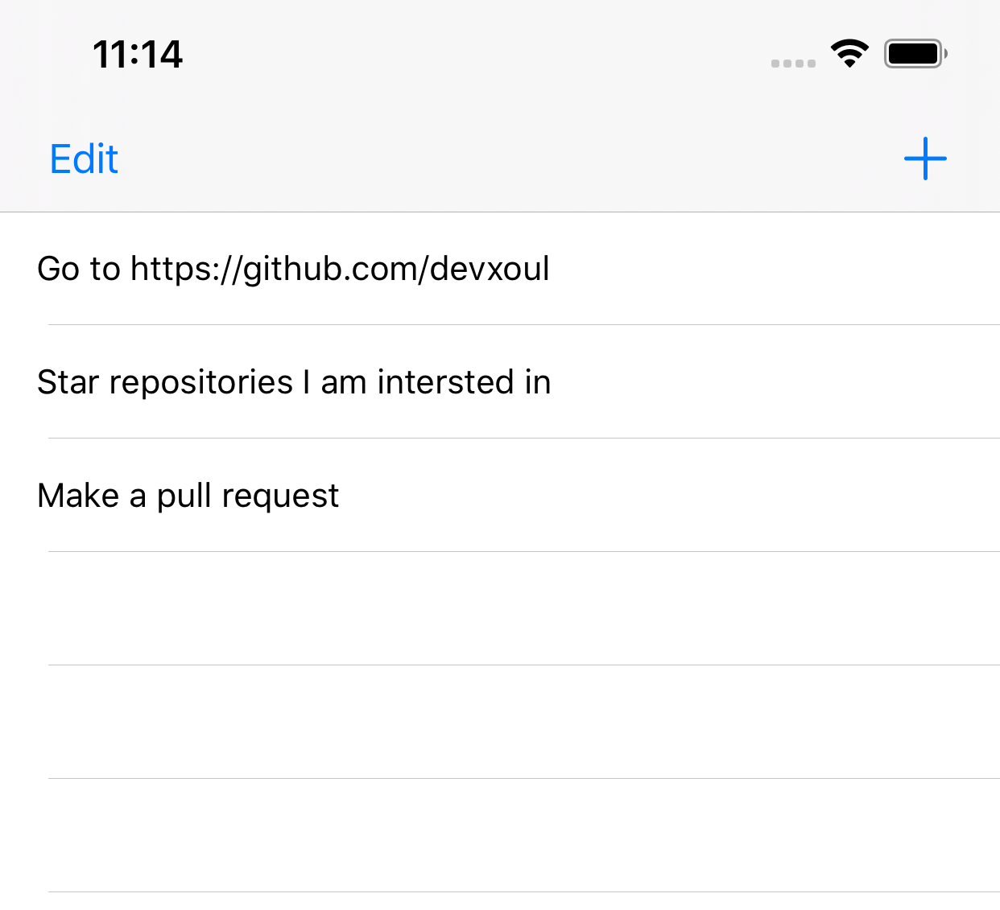

# RxTodo 项目的结构

[RxTodo](https://github.com/devxoul/RxTodo) 是一个 RxSwift 示例项目，该项目简单，从这个项目中可以学习到 RxSwift 在项目中的实际使用。同时，RxTodo 又使用了几个第三方库，可以学习到 RxSwift 和其他框架的配合使用。

## 结构

首页如下：




该首页的控制器为 TaskListViewController。

### TaskListViewController

关联的 Reactor 为 TaskListViewReactor 

### TaskListViewReactor

TaskListViewReactor 中的 state 定义如下：

```swift
struct State {
    var isEditing: Bool
    var sections: [TaskListSection]
}
```

isEditing 标记 tableView 的编辑状态，sections 记录 tableView 的 section 的信息。

### TaskListSection    

TaskListSection 是 SectionModel<Void, TaskCellReactor> 的别名。所以 tableViewCell 的 Reactor 是 TaskCellReactor。

### TaskCellReactor 

TaskCellReactor 中的 state 类型为 Task。也就是说 Task 定义了 tableViewCell 的所有 UI 信息。

```swift
let initialState: Task
```

### Task

Task 的类型为 struct。Task 中定义的属性如下：

```swift
struct Task: ModelType, Identifiable {   
    var id: String = UUID().uuidString
    var title: String
    var memo: String?
    var isDone: Bool = false
}
```

### TaskCell

TaskCell 和 TaskCellReactor 进行绑定。

```swift
typealias Reactor = TaskCellReactor
func bind(reactor: Reactor) {
    ****
}

```

### 小结

RxTodo 的列表 view controller 结构如下：

1. 列表 view controller 和一个 Reacter 进行绑定，这个 Reacter 中使用数组存储列表对应的数据，数组中最内层的数据类型为 cell 对应的 Reactor。
1. 列表中的每个 cell 和一个 Reacter 进行绑定，

在 cell 对应的 state 发送改变的时候：

1. 首先 view controller 对应 Reacter 中数组发生更改，导致整个 tableView 进行刷新。
1. 其次，cell 对应 Reacter 发生更改，导致需要重新绑定，这时 cell 将会根据新的 Reactor 的 state 将所有 UI 进行设置。

感觉这种一个属性更改就要导致整个列表刷新的方式效率不高。可能作者是为了演示 RxSwift 的用法，降低代码阅读的难度，才没有更进一步的优化列表的刷新效率。

## 操作

在对列表上的数据进行操作时，有两个操作流在影响着列表 state 的更改。这两个流是 TaskEvent 流和 Action 流：

- Action 流：用户 UI 操作操作的 action 流
- TaskEvent 流：对数据进行处理的 provider.taskService 发出的 event 流

这两种流同时去影响了 Mutation 流（对 state 进行修改的指令）。下面举两个示例：

1. 点击 cell 切换任务完成状态时，用户操作发出的 Action，会调用 taskService 对数据进行操作，但是返回一个空的数据流。taskService 对数据操作的工程中会发出 TaskEvent 事件流（markAsDone 或者 markAsUndone）。

1. 用户点击切换 tableView 编辑状态时，用户操作 Action 发出 toggleEditing 事件，taskService 没有发出任何 TaskEvent 事件流
    
所以列表状态的 state 由两个方便的数据流影响。这两种数据流通过 [ReactorKit 框架](./articles/ReactorKit.md) 中的方法进行了合并：

```
transform(mutation:) 
```

RxTodo 的具体实现如下（省略了详细的实现）：

```swift
func mutate(action: Action) -> Observable<Mutation> {
    switch action {
        // do something
    }
}

// 将用户的 Action 产生的 Mutation 流和 provider.taskService 产生的 Mutation 流进行合并
func transform(mutation: Observable<Mutation>) -> Observable<Mutation> {
    let taskEventMutation = self.provider.taskService.event
        .flatMap { [weak self] taskEvent -> Observable<Mutation> in
            self?.mutate(taskEvent: taskEvent) ?? .empty()
        }
    return Observable.of(mutation, taskEventMutation).merge()
}

private func mutate(taskEvent: TaskEvent) -> Observable<Mutation> {
    let state = self.currentState
    switch taskEvent {
        // do something
    }
}
```

### 小节

当用户对数据进行操作时，RxTodo 将更改 state 的 Mutation 流分成了两种，一种是由用户直接操作的转化的 Mutation 流，一种是对数据进行处理的 server 产生的 Mutation 流。

这样做将对数据的处理抽离到一个单独的 server 当中，简化了 view 对应 Reacter，使代码的结构更加的清晰。
