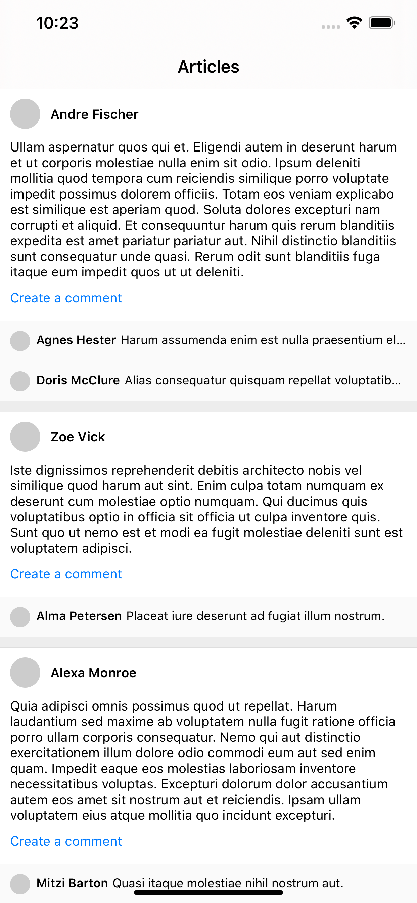

# 「SectionReactor」RxSwift 下 Cell 中的事件通知 TableView / CollectionView 的刷新

使用 RxSwift 时，在一个页面中，经常会遇到这样的情况，在 Cell 中的事件需要通知 TableView / CollectionView 的刷新，那整个的事件流和数据的传递是这样的么？

[SectionReactor][1] 提供了一种解决方案，并提供了一个 Demo，可供我们学习。

项目中有下面的文章列表：ArticleListView，展示试了文章内容和评论。



当点击 `Create a comment` 的时，会在文章下面添加一行评论。

我们首先来拆解 ArticleListView 页面：

- 首先是一个 TableView 作为父控件，承载着所有的内容
- 单篇文章的内容作为一个 Section，其中的作者信息、文章内容、创建评论的按钮和评论使用不同的 Cell 来展示。

ArticleListView 对应的 Reactor 为 ArticleListViewReactor，该 Reactor 的 State 当中有用于控制 TableView\`s Section 的 `sections` 属性。单篇文章对应的 Section 中的 Cell 应该如何展示，由 ArticleSectionReactor 控制。

也就是说：

- ArticleListViewReactor 控制着 TableView 的 Section 的数量
- ArticleSectionReactor 控制着 TableView 中单个 Section 中的 Cell 的数量和形式

下面是 ArticleListViewReactor 的 State 的定义：

```Swift 
final class ArticleListViewReactor: Reactor {
    
    struct State {
        var isRefreshing: Bool = false
        fileprivate var articleSectionReactors: [ArticleSectionReactor] = []
        var sections: [ArticleListViewSection] {
            return self.articleSectionReactors.map(ArticleListViewSection.article)
        }
    }
}
```

接下来梳理一下当点击 `Create a comment` 按钮之后的数据流是怎样的。

#### 评论的产生

`Create a comment` 按钮所在的 Cell，在点击按钮之后，会发出 createComment 的事件，进而进行相关的操作，生成新的评论，并通过 Comment.event 发出新的评论信息。

```swift 
func mutate(action: Action) -> Observable<Mutation> {
    switch action {
    case .createComment:
        return Observable.create { [weak self] observer in
            if let articleID = self?.currentState.articleID {
                let comment = Comment.random(articleID: articleID)
                Comment.event.onNext(.create(comment))
            }
            observer.onCompleted()
            return Disposables.create()
        }
    }
}
```

#### 评论的接收

ArticleSectionReactor 由一个文章数据初始化生成，它监听了 Comment.event 的事件。在接收到 Comment.event 事件时会对当前的文章数据进行修改：

```swift
func transform(mutation: Observable<Mutation>) -> Observable<Mutation> {
    let fromCommentEvent = Comment.event.flatMap { [weak self] event -> Observable<Mutation> in
        guard let self = self else { return .empty() }
        switch event {
        case let .create(comment):
            guard comment.articleID == self.currentState.article.id else { return .empty() }
            return .just(Mutation.appendComment(comment))
        }
    }
    return Observable.merge(mutation, fromCommentEvent)
}
```

#### TableView 的刷新

ArticleListViewReactor 通知 TableView 刷新的时机有两个：

1. 当 state 的 sections 属性改变的时候需要刷新。因为 sections 的属性是只读属性，随着 articleSectionReactors 的改变而改变。所以 articleSectionReactors 数组改变时需要刷新。

1. articleSectionReactors 数组中的每个 ArticleSectionReactor 控制着一个 section 的内容，所以 ArticleSectionReactor 的 state 中的 sectionItems 改变时需要刷新。

其中第一个条件比较容易满足，state 中的 articleSectionReactors 数组改变时，就会生成一个新的 State，TableView 就可以进行刷新了。

但是第二个条件，ArticleListViewReactor 应该如何监听到 ArticleSectionReactor 中 sectionItems 的改变呢？

#### 具体实现

为此，作者专门设计了 [SectionReactor][1] 框架。通过下面一行代码就可以监听到 articleSectionReactors 数组中各个 Reactor 的改变了。


```swift 
func transform(state: Observable<State>) -> Observable<State> {
    return state.with(section: \.articleSectionReactors)
}
```

**实现方式就将 state 的改变和该 state 中 sectionReactors 数组属性中 Reactor 的 state 改变的事件进行了合并。** 上面代码中 `\.articleSectionReactors` 是指明 state 中 sectionReactors 的属性路径。

继续看具体的实现方法：

```swift
public extension ObservableType {
    
    // 当 state 改变或者 sectionReactors 的 state 改变了，都会发送 state 的改变信息，进而通知 View 进行刷新
    func with<State, Section>(
        section sectionReactorsClosure: @escaping (State) -> [Section]?
    ) -> Observable<State> where Element == State, Section: SectionReactor {
        return self.flatMapLatest { state -> Observable<Element> in
            guard let sectionReactors = sectionReactorsClosure(state) else { return .just(state) }
            // sectionStates 有任何变动的时候，都会发出 state
            
            let sectionStates = Observable.merge(sectionReactors.map { $0.state.skip(1) })
            return Observable.merge(.just(state), sectionStates.map { _ in state })
        }
    }
    
    func with<State, Section>(
        section sectionReactorClosure: @escaping (State) -> Section?
    ) -> Observable<State> where Element == State, Section: SectionReactor {
        return self.with(section: { state in sectionReactorClosure(state).map { [$0] } })
    }
}
```

将 State 的事件流转化成两个数据流的合并：

- State 的数据流
- State 的属性 sectionReactors 数组中的 Reactor 的 State 的数据流
  
当这两个数据流发生改变时，都会发出 State 的状态改变。

#### 注意：flatMapLatest 的使用

将两个数据流进行合并的时候，注意是使用的 flatMapLatest。

> flatMapLatest 操作符将源 Observable 的每一个元素应用一个转换方法，生成一个新的 Observable。一旦一个元素转换出一个新的 Observable，就只发出这个新转化而成的 Observable 产生的元素，在此之前转化生成的 Observable 发出的元素将被忽略掉。

因为 State 的属性 sectionReactors 数组中的 Reactor 在进行方法操作的时候可能是异步的。在 State 发生改变之后，应该忽略掉之前的事件，所以此处使用的是：`flatMapLatest`。


[1]:https://github.com/devxoul/SectionReactor
