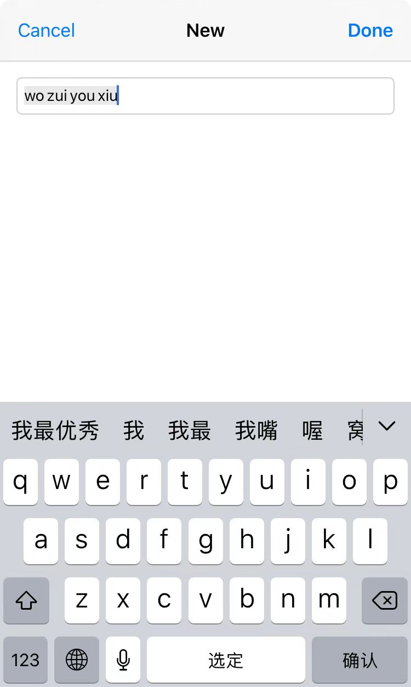

# UITextInput 获取文本内容时移除被标记的文本

在 APP 中，经常会遇到需要用户输入文字的地方，比如设置用户名、填写自我介绍、搜索关键字。在这些场景中，又会有其他需求：

- 限制用户输入文本的长度
- 根据当前输入的文本进行网络请求
- 根据当前文本进行筛选

当用户使用系统键盘输入汉字时，时常会出现文本被标记（marked）的情况。比如用户想输入 **我最优秀**，界面如下：



这个时候 UITextInput 会告诉我们当前的文本内容是：**wo zui you xiu**。这个时候将当前的文本内容进行长度限制，或者将获取到的内容进行网络请求都是不恰当的。所以我们要将当前被标记的内容排除掉。

UITextInput 有一个属性时 `markedTextRange`，官方的注释为：

> If text can be selected, it can be marked. Marked text represents provisionally inserted text that has yet to be confirmed by the user.  It requires unique visual treatment in its display.  If there is any marked text, the selection, whether a caret or an extended range, always resides witihin.
> 
> Setting marked text either replaces the existing marked text or, if none is present, inserts it from the current selection. 

我们可以通过 `markedTextRange` 属性将被标记的（Marked）内容移除，获取到用户已经确定好的内容。在 [RxTodo](https://github.com/devxoul/RxTodo) 中提供了下面的方法来获取到当前 UITextInput 中未被被标记的文本内容。

```
func nonMarkedText(_ textInput: UITextInput) -> String? {
    let start = textInput.beginningOfDocument
    let end = textInput.endOfDocument
    
    guard let rangeAll = textInput.textRange(from: start, to: end),
        let text = textInput.text(in: rangeAll) else {
            return nil
    }
    
    guard let markedTextRange = textInput.markedTextRange else {
        return text
    }
    
    guard let startRange = textInput.textRange(from: start, to: markedTextRange.start),
        let endRange = textInput.textRange(from: markedTextRange.end, to: end) else {
            return text
    }
    
    return (textInput.text(in: startRange) ?? "") + (textInput.text(in: endRange) ?? "")
}
```